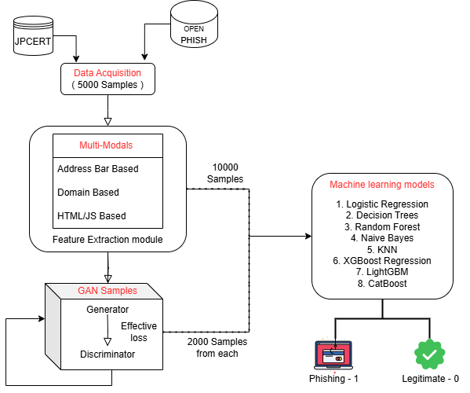

# GAN-Enhanced Phishing Detection: Improving Classifier Robustness with Synthetic Malicious Data

**Guide:** Dr. Sina Keshvadi

## 1. Problem Statement

Phishing attacks constitute one of the most pervasive and evolving cybersecurity threats, exploiting human vulnerability to deceive users into divulging sensitive credentials, financial information, and personal data through fraudulent websites. Traditional rule-based and heuristic detection systems struggle to generalize to novel attack patterns, while conventional machine learning classifiers trained on static datasets exhibit limited robustness against adversarial samples and distribution shift.

This project addresses the challenge of building a **robust, generalizable phishing detection system** that can withstand adversarial manipulation. The central research question is: *Can synthetic data augmentation via Generative Adversarial Networks (GANs) improve the resilience of gradient boosting classifiers against adversarial and previously unseen phishing patterns?*

---

## 2. Methodology

The proposed framework combines **multi-modal feature extraction**, **adversarial data augmentation**, and **gradient boosting classification** into a reproducible, end-to-end pipeline.

### 2.1 High-Level Approach

1. **Feature Engineering**: Extract 15 interpretable URL, domain, and HTML/JavaScript-based features from raw URLs and webpage content.
2. **Data Preprocessing**: Clean missing values, remove duplicates, and apply standardization to ensure numerical stability.
3. **GAN Augmentation** (optional): Train a GAN on phishing-class samples to learn the feature distribution and generate synthetic phishing instances for adversarial training.
4. **Classification**: Train gradient boosting models (XGBoost, LightGBM, CatBoost) on the original or augmented dataset.
5. **Evaluation**: Assess performance using F1 score, precision, recall, ROC-AUC, and accuracy on a held-out test set.

### 2.2 Rationale

- **Gradient Boosting**: State-of-the-art performance on tabular data, interpretability via feature importance, and robustness to feature scaling.
- **GAN Augmentation**: Expands the phishing manifold, exposing the classifier to synthetic adversarial samples and improving generalization.
- **Stratified Splits**: Preserves class balance during train/test partitioning for reliable metric estimation.

---

## 3. Dataset Description

### 3.1 Data Sources

| Source | Description | File(s) |
|-------|-------------|---------|
| **JPCERT/CC** | Japan Computer Emergency Response Team — phishing URLs from security incidents | `202409.csv`, `202410.csv` |
| **University of New Brunswick (UNB)** | Curated legitimate URLs for phishing research ([URL-2016](https://www.unb.ca/cic/datasets/url-2016.html)) | `Legit_datasets.csv` |
| **OpenPhish** | Real-time phishing feed | `feed.txt` |

### 3.2 Processed Data

- **Legitimate samples**: 5,000 URLs (post-deduplication: ~2,600 unique)
- **Phishing samples**: 5,000 URLs (post-deduplication: ~2,600 unique)
- **Labels**: 0 = legitimate, 1 = phishing
- **Train/Test split**: 80% / 20%, stratified

---

## 4. Feature Engineering

Features are extracted from URL structure, domain metadata, and HTML/JavaScript behavior. All features are binary (0/1) or low-cardinality categorical, suitable for gradient boosting.

### 4.1 Address Bar–Based Features

| Feature | Description |
|---------|-------------|
| **Have_IP** | URL contains an IP address instead of a domain name |
| **Have_At** | Presence of `@` symbol (can obscure true destination) |
| **URL_Length** | Long URL (obfuscation indicator) |
| **URL_Depth** | Number of path segments (deeper paths may indicate mimicry) |
| **Redirection** | Multiple consecutive slashes `//` in path |
| **https_Domain** | `http`/`https` embedded in domain name |
| **TinyURL** | Use of URL shortening services |
| **Prefix/Suffix** | Hyphen in domain (typosquatting) |

### 4.2 Domain-Based Features

| Feature | Description |
|---------|-------------|
| **DNS_Record** | Valid DNS record present |
| **Domain_Age** | Domain registration age |
| **Domain_End** | Domain expiration period |

### 4.3 HTML/JavaScript-Based Features

| Feature | Description |
|---------|-------------|
| **iFrame** | Presence of iframe redirection |
| **Mouse_Over** | Status bar customization via JavaScript |
| **Right_Click** | Right-click disabled |
| **Web_Forwards** | Automatic forwarding (meta-refresh, redirects) |

---

## 5. Model Architecture



### 5.1 GAN (Synthetic Phishing Generation)

| Component | Architecture |
|-----------|--------------|
| **Generator** | `Linear(100 → 128) → ReLU → Linear(128 → 256) → ReLU → Linear(256 → 15) → Sigmoid` |
| **Discriminator** | `Linear(15 → 256) → LeakyReLU(0.2) → Linear(256 → 128) → LeakyReLU(0.2) → Linear(128 → 1) → Sigmoid` |
| **Loss** | Binary cross-entropy (BCE) |
| **Optimizer** | Adam (lr=0.0002) |
| **Latent dimension** | 100 |

The GAN is trained exclusively on phishing samples to learn their feature distribution; generated samples are binarized (threshold 0.5) before augmentation.

### 5.2 Gradient Boosting Classifiers

| Model | Implementation | Key Hyperparameters |
|-------|----------------|---------------------|
| **XGBoost** | `XGBClassifier` | `n_estimators`, `learning_rate`, `eval_metric='logloss'` |
| **LightGBM** | `LGBMClassifier` | `n_estimators`, `learning_rate`, `verbose=-1` |
| **CatBoost** | `CatBoostClassifier` | `iterations`, `learning_rate`, `verbose=0` |

---

## 6. Repository Structure

```
GAN-Enhanced-Phishing-Detection/
├── data/
│   ├── raw/                    # Raw URLs (JPCERT, UNB, OpenPhish)
│   └── processed/              # Feature matrices, cleaned dataset
├── src/
│   ├── data/                   # Preprocessing, dataset loading
│   ├── models/                 # GAN, classifiers
│   ├── training/               # Training scripts
│   ├── evaluation/             # Metrics, error analysis
│   └── utils/                  # Reproducibility (seeds)
├── experiments/                # Experiment logs
├── tests/                      # Unit tests
├── notebooks/                  # Exploration, analysis
├── requirements.txt
├── train.py                    # Entry point
└── README.md
```

---

## 7. Training Instructions

### 7.1 Environment Setup

```bash
git clone https://github.com/Varun-Mayilvaganan/GAN-Enhanced-Phishing-Detection
cd GAN-Enhanced-Phishing-Detection

python -m venv venv
# Windows: venv\Scripts\activate
# Unix: source venv/bin/activate

pip install -r requirements.txt
```

### 7.2 Pipeline Execution

**Step 1 — Preprocessing** (requires `legitimate.csv` and `phishing.csv` in `data/processed/`):

```bash
python -m src.data.preprocess --input-dir data/processed --output-dir data/processed
```

**Step 2 — GAN Training** (optional):

```bash
python -m src.training.train_gan --epochs 500 --batch-size 64 --learning-rate 0.0002 --n-samples 2000
```

**Step 3 — Classifier Training**:

```bash
python train.py --model xgboost --learning_rate 0.01 --epochs 50 --batch_size 64
```

**With GAN augmentation**:

```bash
python train.py --model xgboost --gan-samples data/processed/GAN_phishing_samples.csv --gan-ratio 0.5 --epochs 100
```

### 7.3 CLI Arguments

| Argument | Description | Default |
|----------|-------------|---------|
| `--model` | Classifier: `xgboost`, `lightgbm`, `catboost` | `xgboost` |
| `--epochs` | Boosting rounds (n_estimators) | 100 |
| `--learning_rate` | Learning rate | 0.01 |
| `--batch_size` | Batch size (for logging) | 64 |
| `--gan-samples` | Path to GAN-generated phishing CSV | None |
| `--gan-ratio` | Fraction of phishing count to augment | 0.0 |
| `--seed` | Random seed for reproducibility | 42 |

---

## 8. Evaluation Metrics

Performance is evaluated on a stratified 20% held-out test set:

| Metric | Definition |
|--------|------------|
| **F1 Score** | Harmonic mean of precision and recall |
| **Precision** | TP / (TP + FP) |
| **Recall** | TP / (TP + FN) |
| **ROC-AUC** | Area under the receiver operating characteristic curve |
| **Accuracy** | (TP + TN) / (TP + TN + FP + FN) |

Results are logged to `experiments/experiment_log.csv` for experiment tracking.

---

## 9. Results

### 9.1 Gradient Boosting Classifiers

| Model | F1 Score | Precision | Recall | ROC-AUC | Accuracy |
|-------|----------|-----------|--------|---------|----------|
| XGBoost | 0.946 | 0.898 | 1.000 | — | 0.898 |
| LightGBM | 0.946 | 0.898 | 1.000 | 0.970 | 0.898 |

*Note: Results from stratified 80/20 split on cleaned dataset (5,196 samples).*

### 9.2 Baseline Comparison

| Model | Train Accuracy | Test Accuracy |
|-------|----------------|----------------|
| Logistic Regression | 0.949 | 0.945 |
| Decision Tree | 0.953 | 0.948 |
| Random Forest | 0.948 | 0.944 |
| Support Vector Machine | 0.935 | 0.937 |
| XGBoost | 0.960 | 0.959 |
| LightGBM | 0.959 | 0.960 |
| CatBoost | 0.958 | 0.954 |

---

## 10. Future Improvements

1. **Adversarial Evaluation**: Benchmark classifiers against GAN-generated and hand-crafted adversarial samples to quantify robustness gains from augmentation.
2. **Deep Feature Extraction**: Integrate learned representations from URL embeddings or webpage screenshots to capture semantic patterns beyond hand-crafted features.
3. **Real-Time Deployment**: Package the pipeline as a REST API (e.g., FastAPI) for low-latency URL classification in production environments.
4. **Regularization and Cross-Validation**: Apply k-fold cross-validation and hyperparameter tuning to reduce overfitting and improve generalization estimates.
5. **Explainability**: Leverage SHAP or LIME to provide interpretable predictions for security analysts.
6. **Temporal Validation**: Evaluate on time-split data to assess performance under distribution shift as phishing tactics evolve.

---

